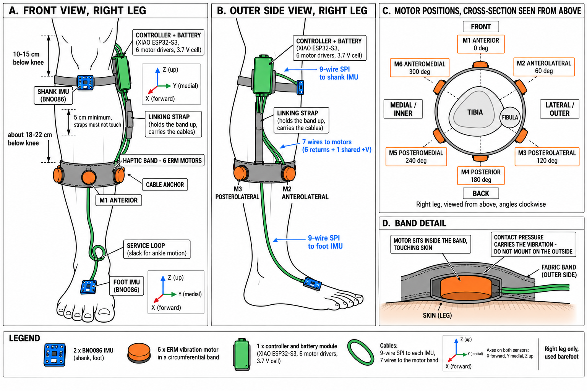

# Hardware (as built)

Contract values come from `ead_agent_docs_v2/02_HARDWARE_WIRING.md`,
`03_GPIO_PIN_MAP.md` and `17_HARDWARE_BOM_AND_OWNED_PARTS.md`. This file records
what the physical unit actually is, how it deviates, and what has been verified.
Every row states its evidence; "unverified" means nobody has measured it yet.

## Current build: DEC-016 (2026-10-02)

| Item | State | Evidence |
|---|---|---|
| Wiring | DEC-016 exactly: two BNO086 on SPI, six motor channels, two HT7833 rails, battery. Every connection in `docs/wiring_reference.md` §3–§11 | User, 2026-10-02, against `EAD_V1_XIAO_connections.pdf` (whose pins match DEC-016) |
| Parts fitted | Everything, including the six motors | User, 2026-10-02 |
| Motors | The user tested them with a plain PWM signal (how, and from what, not recorded) | User, 2026-10-02 |
| Powered | Yes, since assembly | User, 2026-10-02 |
| `wiring_reference.md` §13 pre-power checks | Not recorded | — |
| HT7833 part and the pinout it was soldered by | Not recorded (§7 said not to solder by the Airupton table until the part is known) | — |
| Which XIAO | The one measured in TEST-041: USB serial number (= MAC) `44:B1:76:AF:FB:7C` | Read from the USB descriptor, 2026-10-02 |
| Firmware on it | The product firmware, schema 5 (`5b8dd28` and later), on the DEC-016 pins. Before that, `padstate`, which booted on the new wiring (TEST-044) | HELLO, 2026-10-02 |
| ERM driver | Separate PCB from `~/Documents/ead pcb/`: Holtek HT7833 SOT-89 ×2, IRLML6344 ×6, 1N5819W, 100 Ω / 100 kΩ, 10 nF across each motor, 100 nF per channel. Motors rated 3 V, 90 mA, 120 mA at start. Its bring-up on 2026-09-24 ran the motors at 20 kHz PWM from GPIO1–6 (`erm_channel_test.ino`); a stuck-motor event there has no established root cause | PCB project docs |
| Measured on the assembled build | Both BNO086s pass every wiring, identity and data check at 1 MHz (TEST-043). Pad readback: GPIO42 (motor 3) read low, unlike the other five; MTMS measured about 100 kΩ to GND (user), the correct gate network (PROB-020, resolved) | TEST-043, TEST-044, user |
| XIAO power | The switched LOAD+ feeds the ERM driver's PWR+ **and the XIAO's 5V (VUSB) pin**, not its BAT+ pad. **The XIAO has no diode on that pin**, so with USB plugged in, USB 5 V sits on the switched node: switch OFF, it powers the ERM driver (motor rails live); switch ON, it meets the charger's LOAD+ (PROB-021) | User, 2026-10-02; Seeed XIAO ESP32-S3 wiki |
| Foot cable | About 30 cm | User, 2026-10-02 |
| Charger | SmartElex MCP73833 module (Robocraze): USB mini-B, 500 mA default charge, separate battery and load connectors. Its product page names no protection IC; whether the cell has its own protection board is not recorded | User, 2026-10-02; product page |

**Only firmware on the DEC-016 pins goes on this build:** the product firmware from
`5b8dd28` on, `firmware/bench/bno086`, or `padstate`. Product firmware from before
`5b8dd28` uses the doc-03 pins: it would run I²C bus recovery and `Wire` on GPIO5/6
(motor gates 5 and 6) and drive GPIO9 (MOSI), 43 and 44 (both chip selects) LOW as
motors.

`padstate` is not harmless on this build either: at each boot its readback switches
each pin's internal pull-up on for 0.3 ms, which on a motor pin puts about 2.3 V on
the gate (the DEC-016 GPIO39 reasoning) and switches that MOSFET on for 0.3 ms. That
is far too short to spin an ERM. It follows from the code; it has not been measured.

The sections below describe the previous build (MPU6500 on I²C, 2026-09-17 to
2026-10-01), on which every recording and dashboard session so far was made.

## Controller

| Item | Value | Evidence |
|---|---|---|
| Board | Seeed XIAO ESP32-S3 | PlatformIO env `seeed_xiao_esp32s3` |
| Flash / PSRAM | 8 MB / 8 MB (OPI) | Board definition (`-DBOARD_HAS_PSRAM`, `qio_opi`); PSRAM presence on this unit unverified until the M1 self-test |
| USB | Native USB Serial/JTAG, VID:PID `303a:1001`, serial number = Wi-Fi MAC `44:B1:76:AF:FB:7C` | `lsusb` / `udevadm`, 2026-09-17 |
| Partition table | `default_8MB.csv`: 2 × 3.2 MB app slots, 1.5 MB data (`spiffs`), 64 KB coredump | Arduino-ESP32 2.0.17 package |
| Wi-Fi antenna | Seeed recommends fitting the supplied U.FL antenna for usable Wi-Fi range | Seeed wiki (accessed 2026-09-17); fitted on this unit: unverified |
| Power | Battery-powered and wearable (user, 2026-09-17). Firmware has no battery or charger logic (spec) | User statement |

## IMUs (previous build)

Both breakouts were sold as MPU6050 but carry **MPU6500** silicon.

| Sensor | I²C address | WHO_AM_I | Evidence |
|---|---|---|---|
| Foot (dorsum) | `0x68` (AD0 → GND) | `0x70` | Boot log 2026-09-17 |
| Shank (anterior shin) | `0x69` (AD0 → 3V3) | `0x70` | Boot log 2026-09-17 |

Register configuration written at boot and verified by readback on both sensors
(boot log + `c` diagnostics, 2026-09-17):

| Register | Address | Value | Meaning |
|---|---|---|---|
| PWR_MGMT_1 | 0x6B | 0x01 | Awake, PLL clock source |
| SMPLRT_DIV | 0x19 | 0x09 | 1 kHz / 10 = 100 Hz output |
| CONFIG | 0x1A | 0x03 | Gyro DLPF ≈ 41–42 Hz |
| ACCEL_CONFIG2 | 0x1D | 0x03 | Accel DLPF ≈ 41 Hz (MPU6500 only; see PROB-003) |
| GYRO_CONFIG | 0x1B | 0x08 | ±500 °/s, 65.5 LSB/(°/s) |
| ACCEL_CONFIG | 0x1C | 0x08 | ±4 g, 8192 LSB/g |
| INT_PIN_CFG | 0x37 | 0x00 | Active-high, push-pull, 50 µs pulse |
| INT_ENABLE | 0x38 | 0x01 | Data-ready interrupt |

Observed at rest on a desk (not worn), 78 samples over 7.8 s, 2026-09-17:
foot |a| = 1.024 g, shank |a| = 1.014 g, accel σ ≤ 0.002 g, gyro offsets up to
3.1 °/s (foot X) and 2.0 °/s (shank Y). The offsets are ordinary MEMS gyro bias;
startup calibration (milestone M3) removes them.

## Pin map of the previous build (doc 03)

The current build's pin map is DEC-016, in `docs/wiring_reference.md` §3.

| Function | XIAO pin | ESP32-S3 GPIO | Status |
|---|---|---:|---|
| I²C SDA | D4 | 5 | Verified: both IMUs enumerate |
| I²C SCL | D5 | 6 | Verified: both IMUs enumerate |
| Foot IMU INT | D8 | 7 | Wiring unverified; interrupt-count test is the first M1 step |
| Shank IMU INT | D9 | 8 | Wiring unverified; interrupt-count test is the first M1 step |
| Motor 1 PWM | D0 | 1 | Held LOW; driver not fitted |
| Motor 2 PWM | D1 | 2 | Held LOW; driver not fitted |
| Motor 3 PWM | D3 | 4 | Held LOW; driver not fitted |
| Motor 4 PWM | D10 | 9 | Held LOW; driver not fitted |
| Motor 5 PWM | D6 | 43 | Held LOW; driver not fitted; see PROB-004 |
| Motor 6 PWM | D7 | 44 | Held LOW; driver not fitted; see PROB-004 |

## Sensor mounting and axis maps

The anatomical frame (doc 04 §1) is X forward toward the toes, Y medial (left for
the right leg), Z up. It is right-handed, and so is the MPU chip frame, so each
sensor's chip → anatomical map must be a proper rotation (determinant +1).
`firmware/include/config_v1.h` stores the maps as signed-permutation matrices and
rejects anything else at compile time.

| Sensor | Physical mounting | Map (anat = M · chip) |
|---|---|---|
| Foot | Flat on the dorsum, chip X toward the toes, chip Z up | Identity |
| Shank | Strapped to the anterior shin; chip +Z toward the bone (posterior); chip +X up the leg | `X = −chipZ`, `Y = +chipY`, `Z = +chipX` |

Derivation of the shank map: measured on the leg (TEST-027, 2026-09-17). Under the
previous map (`X = −chipZ`, `Y = +chipX`, `Z = −chipY`) standing still put gravity
on anatomical Y (+0.99 g) and a seated knee extension turned about anatomical Z
(+43 °/s) — anatomical Y and Z were interchanged. Correcting the measurement
(`Z_true = Y_measured`, `Y_true = −Z_measured`) gives the map above, which is still
a proper rotation. The earlier derivation assumed chip +Y points down the leg; the
board is in fact strapped with chip +X up the leg.

**Placement image discrepancy.** `reference_images/RIGHT_LEG_IMU_PLACEMENT.png`
draws the shank board with its axes labelled as if it matched the foot board. A
board lying flat on a vertical shin cannot have chip Z pointing up, so the image
cannot describe any real shank mounting. The user confirmed the image is wrong
about the shank board and right about the anatomical convention. The contract
file is left unmodified; this table is the as-built record (DEC-009).

**Verification status.** Compile-time proper-rotation checks pass, including a
negative test with a reflected map. The shank map above was measured on the leg
(TEST-027) and flashed; re-running the mounting check with it is the confirmation
step. The foot map was confirmed on the leg: gravity dominant on +Z, the board
tilted about 33° on the instep, which calibration removes.

## Haptics

ERM driver channels (IRLML6344 + flyback diode) are **not fitted** (user,
2026-09-17). Firmware contains no PWM or haptic code (DEC-006); the six motor GPIOs
are driven LOW as the first action in `setup()`.

On the DEC-016 build the channels and motors are fitted (user, 2026-10-02); nothing
about them has been measured. DEC-006's condition for haptic code (drivers fitted)
is now met; lifting it is the user's decision.

## Known hardware risks

- **PROB-004 (unverified):** GPIO43 is UART0 TX, and the ESP32-S3 ROM prints its
  boot log on it before firmware runs. Once drivers are fitted, the M5 gate may see
  that serial waveform at every reset. Measure with a logic probe before fitting
  drivers. Moot on DEC-016, where GPIO43 is the foot CS and SCK carries no clock
  during boot.
- **Fixed sensor ranges (doc 00):** ±4 g and ±500 °/s may clip foot impacts and fast
  swing. The M3 recordings measure how often samples saturate before any change is
  proposed. They did clip at heel strike (PROB-011). The BNO086 runs at ±8 g and
  ±2000 °/s (TEST-040).

## BNO086 bench test (one sensor, SPI)

A single BNO086 breakout (7Semi, CEVA/Hillcrest SH-2) wired to a XIAO ESP32-S3 for
bring-up. Edge pins only, so nothing has to be soldered to the pads under the board.
This is the bench layout; it is not the product pin map, because D0–D3 are the
motor outputs in the product.

| Function | XIAO pin | ESP32-S3 GPIO |
|---|---|---:|
| 3V3 | 3V3 | — |
| GND | GND | — |
| SPI SCK | D8 | 7 |
| SPI MISO | D9 | 8 |
| SPI MOSI | D10 | 9 |
| CS | D3 | 4 |
| INT | D2 | 3 |
| RST | D1 | 2 |
| WAKE (= PS0 net on this board) | D0 | 1 |

PS0, PS1, BOOT, SDA, SCL and both Qwiic connectors are left unconnected. The board's
PS0/PS1 solder jumpers were opened by the user, so the on-board pull-ups hold both
high at reset and the part comes up in SPI mode; its I²C connectors no longer work.
WAKE and PS0 are the same net, so WAKE must be driven high before reset is released,
or the part would latch a UART mode instead.

Measured on this board, 2026-09-23 (TEST-039):

- Line readback (ESP32 pull-up / pull-down, sensor held in reset): CS 1/0 (floating,
  as expected); SCK, MISO and MOSI all 1/1, because on the BNO086 those are the same
  chip pins as SCL, SDA and SA0, which carry the breakout's I²C pull-ups. 0/0 on any
  line would mean it is held low: a short to ground or a wire on the wrong pin.
- INT is high while RST is held low, and goes low 112–115 ms after reset is released.
- SH-2 opens at 3 MHz, SPI mode 3.
- Product ID: 4 entries, the application firmware being part 10004563, version
  3.12.6, build 62, reset cause 4 (external reset — the RST pulse).
- Feature probe: ARVR-stabilised RV, gyro-integrated RV, stability classifier,
  magnetometer and tap detector all accept a set-feature request.
- Pulling WAKE low with no reports enabled made the sensor assert INT within 1 ms.
- At rest: |a| = 9.752 m/s² over 249 accelerometer reports, |ω| = 0.005 rad/s over
  199 gyro reports. Rotation vector, accelerometer and gyro stream together at
  99.9 Hz (2952 samples over 29.5 s).
- The rotation vector's accuracy field stays at 180° because the magnetometer has
  not been calibrated. Tilt is still correct; only heading is unreferenced. The
  product should use the game rotation vector (6-axis), which needs no magnetometer.

### What the BNO086 says about its own hardware (TEST-040, 2026-09-23)

| Reading | Value |
|---|---|
| Accelerometer | `Bosch Sensortec BMA280`, range 20082 (Q8 → 78.4 m/s² = ±8 g), q = 8 |
| Gyroscope | `Bosch Sensortec BMI055`, range 17863 (Q9 → 34.9 rad/s = ±2000 °/s), q = 9 |
| Magnetometer | `Bosch Sensortec BMM150`, range 32000, q = 4 |
| Rotation vector | range 16384, q = 14 |
| Oscillator | external crystal |
| FRS serial number | record present, empty |
| Interactive Calibration (BNO086 only) | Motion Intent accepted, Motion Request report accepted |
| Accelerometer resolution | 1120 steps per g over ±8 g = 14.1 bits (14-bit fusion is BNO086 only) |

Raw accelerometer counts come out as multiples of 4: the BMA280's 14-bit value sits
left-aligned in a 16-bit field. Lower idle power, the third BNO086-only item, needs a
current meter and has not been measured.

### The bench project on the DEC-016 wiring (2026-10-02)

The one-sensor bench wiring above no longer exists: the user reported on
2026-10-02 that the XIAO is now wired to DEC-016 with everything soldered. On that
wiring the old bench pins D0, D1 and D3 are motor gates 1, 2 and 4, so
`firmware/bench/bno086` was moved to the DEC-016 pins:

- One sensor per build: `-e foot` (CS GPIO43, INT GPIO39) or `-e shank` (CS GPIO44,
  INT GPIO40); RST GPIO41 and WAKE GPIO3 are shared. The SparkFun library cannot
  drive two sensors at once: its pins are file-scope globals and CEVA's `sh2.c`
  inside it has one global instance (read in the library source, v1.0.6).
- First action: the six motor gates (GPIO1, 2, 42, 4, 5, 6) LOW, then both CS high.
  A `static_assert` refuses any build that puts a sensor line on a motor pin.
- SPI at 1 MHz (`docs/wiring_reference.md` rule 5), not the 3 MHz used on the bench.
- Also reports whether the other sensor's INT is high in reset and low after the
  shared RST is released, without talking to it.

Not yet run on hardware (TEST-043).

## Connection reference

`docs/wiring_reference.md` carries every electrical connection in one place:
the XIAO's full pin map, both BNO086 pinouts, the six ERM motor channels, the
haptic rails, the harnesses and the power input, each connection marked with
the evidence behind it. It is the document to hand to whoever builds the board.

## Worn assembly (planned, DEC-015)

*`docs/images/worn_assembly.png`. Generated illustration, checked against the
contract and this table. **Two known errors, both in panel A only:** the
controller is drawn on the inner side of the leg — panel B has it correctly on
the outer side — and the foot is drawn as a left foot, with the big toe on the
outer edge. **A third error, found later (2026-10-01): the motor cable label
"7 wires (6 returns + 1 shared +V)" is wrong — it is 8**, because the two haptic
regulators' outputs must stay separate, so each half of the band needs its own
positive wire (`docs/wiring_reference.md` §11). Everything else was verified: the
six motor angles and their clockwise order, the fibula on the lateral side, M2
toward the toes and M3 toward the calf in the side view, and both sensor axis
triads.*

Two separate straps on the right shank, plus the foot module. Nothing below is
built yet: the ERM drivers are not fitted (DEC-006) and the BNO086 sensors are
still on the bench.

| Item | Position | Notes |
|---|---|---|
| Shank IMU (BNO086) | Anterior shin, 10–15 cm below the knee, on the upper strap | Doc 01 §2 |
| Controller + battery | Lateral side of the same upper strap | Position not specified by the contract; chosen to keep every cable short except the foot run |
| Six ERM motors | Lower strap, around the fullest part of the calf, below the upper strap | Angles per doc 06 §7: M1 anterior 0°, then clockwise viewed from above |
| Foot IMU (BNO086) | Dorsum of the foot, midfoot, lying flat | Doc 01 §2 |

Cable runs: 9 conductors to the shank IMU (3V3, GND, SCK, MISO, MOSI, CS, INT,
RST, WAKE), 10 to the foot IMU (the same plus a second ground beside SCK, for
the long run), and **8 to the motor band**: six switched returns, one positive
from haptic rail A for M1–M3, and one from rail B for M4–M6. The two rails come
from separate regulators whose outputs must never be joined
(`ead_agent_docs_v2/02_HARDWARE_WIRING.md` §5). An earlier revision said 7 with
one shared positive; that would have tied the two regulator outputs together.

Practical points for the build, none of them yet verified on a leg:

- Leave at least 5 cm between the two straps, and do not let them touch: touching
  straps couple vibration mechanically, on top of what travels through tissue.
- The calf tapers below its fullest point, so the motor band will tend to slide
  down. A short vertical strap between the two bands, doubling as the cable
  channel, holds it up.
- Anchor the foot cable to the **motor** band before it runs down the shin. A tug
  on that cable must not reach the IMU strap, because rotating that strap
  invalidates the shank mount map mid-session.
- Keep the controller enclosure on the lateral side, off the tibia, and tight
  enough not to bounce; its mass sits on the same strap as the IMU.
- Leave slack in the strap-to-strap wiring: calf circumference changes as the
  muscle contracts.
